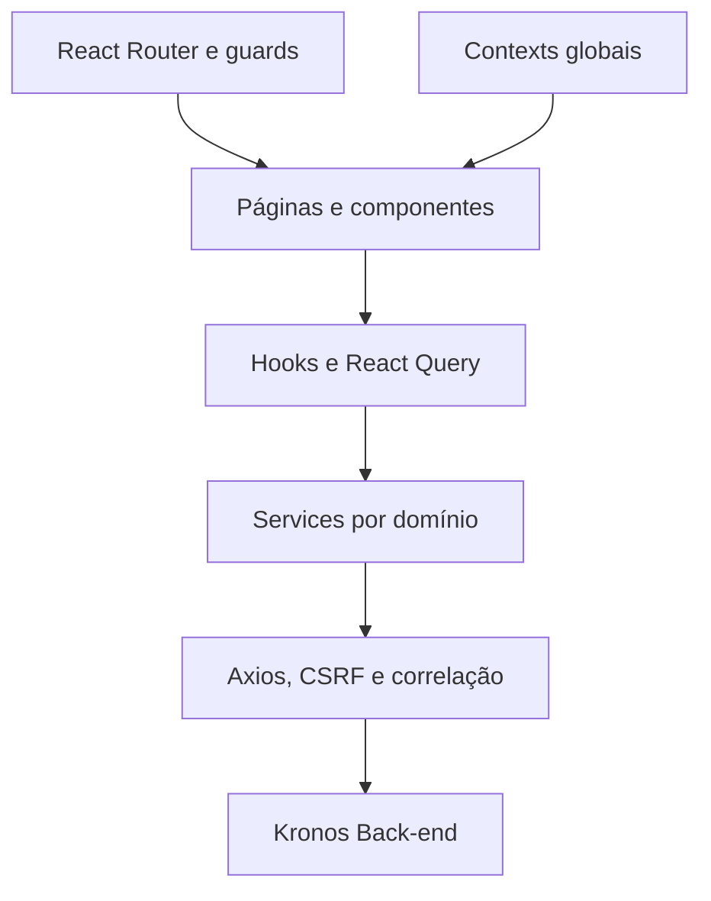

<p align="center">
  
</p>

# Kronos User Platform

[](https://github.com/LsaBarbosa/Kronos-Tech-Solution-User-Plataform/actions/workflows/ci.yml)


Aplicação web oficial da plataforma **Kronos**, desenvolvida para centralizar gestão de jornada, pessoas, documentos, aprovações, assinaturas eletrônicas, obrigações trabalhistas e privacidade de dados.

O projeto entrega experiências responsivas para colaboradores, gestores e administradores, consumindo exclusivamente os contratos HTTP publicados pelo back-end Kronos.

## Principais recursos

| Módulo | Recursos |
|---|---|
| Autenticação | Login por senha ou face, primeiro acesso, recuperação de senha, sessão protegida e seleção de empresa |
| Dashboard | Resumo operacional, jornada do dia, pendências, avisos e atalhos por perfil |
| Ponto e jornada | Check-in, histórico, ajustes, relatórios, espelho de ponto e assinatura mensal |
| Pessoas e empresas | Colaboradores, usuários, empresas, perfis de acesso e contexto multiempresa |
| Solicitações | Férias, abonos, marcações manuais e fluxos de aprovação |
| Documentos e contratos | Upload, consulta, download, distribuição e assinatura eletrônica |
| Legal e fiscal | AFD, AEJ, atestado técnico, espelho de ponto e exportações |
| LGPD e privacidade | Centro de privacidade, solicitações do titular, exportação, consentimento biométrico, anonimização e inventário de tratamento |
| Comunicação e suporte | Mural de avisos, FAQ contextual e experiência de atendimento |
| Administração | Saúde da plataforma, operações de empresa e sandbox de demonstração para CTO |

## Perfis de acesso

| Perfil | Escopo principal |
|---|---|
| `PARTNER` | Acesso aos próprios registros, documentos, solicitações, assinaturas e dados pessoais |
| `MANAGER` | Gestão de equipe, aprovações, contratos, auditoria e solicitações LGPD da empresa |
| `CTO` | Administração global de empresas, acessos, inventário LGPD, retenção e operações de plataforma |

As rotas da interface são protegidas por autenticação e papel, mas a autorização definitiva permanece no back-end.

## Arquitetura



### Organização do código

```text
src/
├── assets/          # Recursos visuais da marca
├── components/      # Componentes compartilhados, layouts, guards e UI base
├── config/          # Cliente HTTP, rotas de API e metadados de navegação
├── context/         # Sessão e estado global de check-in
├── features/        # Módulos de negócio organizados por domínio
├── hooks/           # View models, queries, mutations e comportamento reutilizável
├── lib/             # Infraestrutura compartilhada
├── observability/   # Eventos, performance, correlação e sanitização
├── pages/           # Páginas registradas no roteador
├── service/         # Integrações HTTP e normalização de contratos
├── test/            # Setup, fixtures e handlers MSW
├── types/           # Tipos de domínio e contratos do cliente
└── utils/           # Formatação, segurança e utilitários

e2e/                 # Cenários Playwright
docs/                # Arquitetura, contratos e operação
public/              # Arquivos estáticos e fallback da SPA
```

### Princípios adotados

- rotas da aplicação centralizadas em `src/config/app-routes.ts`;
- rotas HTTP centralizadas em `src/config/api-routes.ts`;
- integrações externas isoladas em `src/service`;
- estado remoto gerenciado por TanStack React Query;
- páginas compostas por features, hooks e componentes reutilizáveis;
- contratos e respostas normalizados antes de chegar à interface;
- estados de carregamento, vazio, erro e sucesso tratados explicitamente;
- experiências específicas para desktop e mobile nos fluxos que exigem maior adaptação.

## Stack tecnológica

| Categoria | Tecnologias |
|---|---|
| Interface | React 18 e TypeScript 5.8 em modo estrito |
| Build | Vite 8 e SWC |
| Roteamento | React Router DOM |
| Estado assíncrono | TanStack React Query |
| HTTP | Axios |
| Formulários | React Hook Form e Zod |
| Design system | Tailwind CSS, Radix UI e componentes compartilhados |
| Gráficos e documentos | Recharts, jsPDF e jsPDF AutoTable |
| Biometria | face-api.js e APIs de câmera do navegador |
| Testes | Vitest, Testing Library, MSW e Playwright |
| Qualidade | ESLint, TypeScript, cobertura V8, npm audit e Gitleaks |

## Pré-requisitos

- Node.js 22;
- npm;
- back-end Kronos disponível localmente ou em um ambiente acessível;
- navegador moderno com suporte às APIs usadas pela aplicação.

## Execução local

### 1. Obtenha o projeto

```bash
git clone https://github.com/LsaBarbosa/Kronos-Tech-Solution-User-Plataform.git
cd Kronos-Tech-Solution-User-Plataform
git switch VPS_PRODUCTION_KRONOS_V1
```

### 2. Configure o ambiente

```bash
cp .env.example .env.local
```

Configuração padrão:

```env
VITE_API_BASE_URL=http://localhost:8080
VITE_BIOMETRIC_LIVENESS_REQUIRED=false
VITE_OBSERVABILITY_ENABLED=false
VITE_OBSERVABILITY_ENDPOINT=
```

Toda variável com prefixo `VITE_` é incorporada ao bundle e pode ser lida no navegador. Nunca armazene senhas, tokens ou credenciais privadas nessas variáveis.

### 3. Instale e execute

```bash
npm ci
npm run dev
```

A aplicação ficará disponível em `http://localhost:5173`.

## Variáveis de ambiente

| Variável | Finalidade |
|---|---|
| `VITE_API_BASE_URL` | URL base da API. Em produção, quando ausente, a aplicação usa `window.location.origin` |
| `VITE_BIOMETRIC_LIVENESS_REQUIRED` | Exige o resultado de liveness nos fluxos biométricos habilitados |
| `VITE_OBSERVABILITY_ENABLED` | Habilita o envio sanitizado de eventos do front-end |
| `VITE_OBSERVABILITY_ENDPOINT` | Endpoint de ingestão dos eventos de observabilidade |
| `VITE_GOOGLE_MAPS_API_KEY` | Mantida no template de ambiente; não é consumida pelo fluxo atual de geolocalização |

A geolocalização usada pela plataforma é resolvida pelo back-end. Não coloque chaves privadas de provedores no cliente.

## Autenticação e sessão

O cliente usa autenticação baseada em **JWT armazenado em cookie HTTP-Only**:

1. o login envia as credenciais para `POST /auth/login`;
2. o back-end responde `204 No Content` e define o cookie seguro;
3. o Axios envia o cookie com `withCredentials: true`;
4. operações que alteram estado obtêm e enviam o token CSRF;
5. respostas `401` encerram o estado local e redirecionam para o login;
6. pendências de consentimento são tratadas pelo guard de termos;
7. rotas administrativas passam também pelo guard de papel.

Tokens de autenticação não são armazenados em `localStorage` ou `sessionStorage`.

## Scripts

| Comando | Finalidade |
|---|---|
| `npm run dev` | Inicia o servidor de desenvolvimento |
| `npm run build` | Gera o bundle de produção em `dist/` |
| `npm run preview` | Serve localmente o bundle gerado |
| `npm run lint` | Executa o ESLint |
| `npx tsc --noEmit` | Valida os tipos |
| `npm run test` | Executa a suíte Vitest |
| `npm run test:coverage` | Executa testes e gera cobertura |
| `npm run test:watch` | Executa testes em modo interativo |
| `npm run test:e2e` | Executa os cenários Playwright |
| `npm run generate:api-types` | Gera tipos a partir do contrato OpenAPI versionado |
| `npm run analyze` | Gera `dist/bundle-stats.html` para análise do bundle |

## Testes e qualidade

A estratégia de validação inclui:

- testes unitários de componentes, hooks, utilitários e serviços;
- testes de integração de interface com Testing Library e MSW;
- guards de contrato para rotas, documentos e tipagem;
- cenários E2E com Playwright;
- limites mínimos de cobertura configurados no Vitest;
- TypeScript estrito e lint;
- auditoria de dependências e varredura de segredos no CI.

Antes de publicar:

```bash
npm run lint
npx tsc --noEmit
npm run test
npm run test:coverage
npm run build
```

Quando o fluxo alterado possuir cenário E2E:

```bash
npm run test:e2e
```

## Segurança e observabilidade

- autenticação em cookie HTTP-Only e proteção CSRF;
- guards de sessão, consentimento e papel;
- IDs de correlação adicionados às requisições;
- normalização centralizada de erros;
- logs do cliente passam por utilitário seguro;
- eventos de observabilidade são sanitizados antes do envio;
- source maps ficam desabilitados no build de produção;
- o CI executa Gitleaks, `npm audit`, lint, tipos, testes, cobertura e build.

Dados biométricos, credenciais, CPF, CNPJ, e-mail e outros dados pessoais não devem ser registrados no console nem enviados à observabilidade.

## Build e deploy

### Build de produção

```bash
cp .env.production.example .env.production.local
npm ci
npm run build
```

O artefato final é gerado em `dist/`.

### Roteamento em produção

Na topologia atual, SPA e API podem compartilhar o mesmo domínio. O proxy deve encaminhar os namespaces da API ao Spring Boot e entregar `index.html` para rotas do React Router.

Exemplos:

| Requisição | Destino |
|---|---|
| `GET /dashboard` | SPA React |
| `GET /avisos` | SPA React |
| `GET /dashboard/summary` | API Spring Boot |
| `POST /auth/login` | API Spring Boot |
| `GET /records/pending-approvals` | API Spring Boot |

O arquivo `public/.htaccess` é copiado para o build e fornece o fallback da SPA em Apache/LiteSpeed. Para Nginx, configure `try_files $uri $uri/ /index.html` depois das regras de proxy da API.

Consulte [docs/DEPLOYMENT.md](docs/DEPLOYMENT.md) para a topologia e o checklist completos.

## Documentação

- [Arquitetura do front-end](docs/frontend-architecture.md)
- [Autenticação e sessão](docs/AUTHENTICATION.md)
- [Configuração de ambiente](docs/ENV_CONFIGURATION.md)
- [Deploy na Hostinger](docs/DEPLOYMENT.md)
- [Rotas da API consumidas](src/config/api-routes.ts)
- [Integração LGPD](docs/LGPD-FRONTEND-INTEGRATION-GUIDE.md)
- [Avaliação da estratégia MSW](docs/testing/msw-evaluation.md)
- [Configuração do Gitleaks](docs/security/GITLEAKS_SETUP.md)

## Repositório relacionado

- [Kronos Tech Solutions — Back-end](https://github.com/LsaBarbosa/Kronos-Tech-Solutions-KTS/tree/VPS_PRODUCTION_KRONOS_V1) — API, regras de negócio, persistência, segurança e integrações.

## Colaboração

1. Confirme o contrato correspondente no back-end.
2. Centralize novos endpoints e metadados de rota nas configurações existentes.
3. Mantenha regras de negócio fora dos componentes visuais.
4. Preserve responsividade, acessibilidade e estados de interface.
5. Adicione testes para o comportamento alterado.
6. Execute todas as validações de qualidade antes de publicar.
7. Atualize a documentação quando houver mudança de contrato ou operação.

## Licença e uso

Não há licença pública associada a este repositório. O código é proprietário e seu uso, distribuição ou reutilização depende de autorização expressa da Kronos Tech Solutions.
